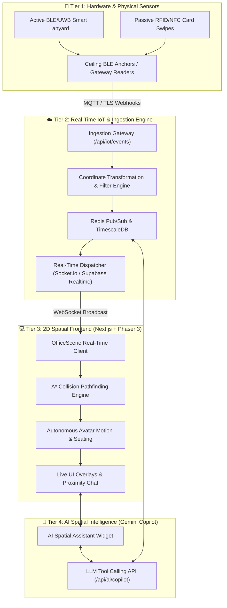
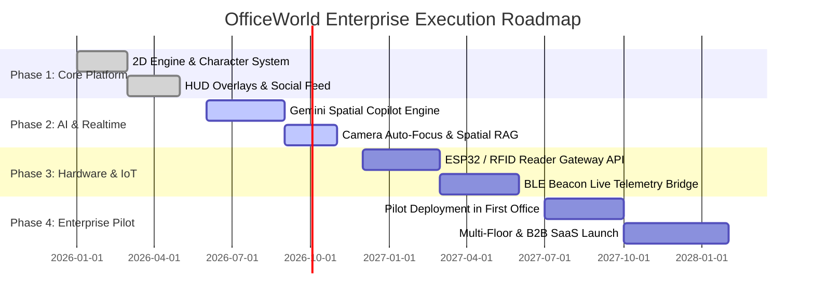

# OfficeWorld: Master Product Architecture & Business Blueprint
## Real-Time IoT Digital Twin, Smart ID Badge Tracking & AI Workplace Copilot

---

## 1. Executive Vision & Business Overview

### 1.1 Product Vision
**OfficeWorld** is an enterprise spatial digital twin platform that merges physical smart buildings with an interactive, gamified 2D virtual workspace. By connecting physical employee ID cards, BLE/UWB smart badges, access control hardware, and an **AI Spatial Copilot**, OfficeWorld enables organizations to visualize physical office presence in real-time, automate room bookings, perform instant AI spatial lookups, and cultivate a connected workplace culture.

```
┌────────────────────────────────────────────────────────────────────────────────────────┐
│                                 THE TRI-PILLAR PLATFORM                                │
├──────────────────────────┬─────────────────────────────┬───────────────────────────────┤
│ 1. 2D Interactive Twin   │ 2. Real-World IoT & Badges  │ 3. Spatial AI Copilot         │
├──────────────────────────┼─────────────────────────────┼───────────────────────────────┤
│ • Gamified top-down map  │ • BLE/UWB smart lanyards    │ • "Where is Amal right now?"  │
│ • Real-time avatar walks │ • RFID/NFC door swipes      │ • Auto meeting summaries      │
│ • Custom avatars & Snaps │ • Automated attendance      │ • Smart hot-desk finder       │
│ • Proximity chat & HUD   │ • Instant zone check-ins    │ • Camera auto-focus & zoom    │
└──────────────────────────┴─────────────────────────────┴───────────────────────────────┘
```

---

## 2. Global Target Markets & Industry Use Cases

| Industry | Physical Hardware | Virtual 2D Space | Primary Value Proposition |
| :--- | :--- | :--- | :--- |
| **Tech & Corporate Enterprises** | Smart ID Badges / Turnstiles | Corporate Office / Floors | Hybrid work visibility, team connectivity, room utilization |
| **Universities & Colleges** | Student / Faculty RFID Cards | Campus Map / Lecture Halls | Automatic class attendance, professor locating, campus safety |
| **Hospitals & Healthcare** | BLE Lanyards on Staff & Equipment | Hospital Ward / ICU / ER | Emergency doctor location, mobile medical equipment tracking |
| **Coworking Chains (WeWork)** | Mobile NFC / QR Access | Coworking Floor / Hot Desks | Real-time hot desk availability, community networking |
| **Factories & Logistics** | Safety Vest / Hardhat Beacons | Warehouse Aisles & Docks | Worker safety zones, forklift collision alerts, evacuation count |

---

## 3. End-to-End Technical Architecture



---

## 4. The AI Spatial Workplace Copilot

The AI Copilot allows any employee or executive to interact with the physical and virtual office using natural human language.

```
                  ┌────────────────────────────────────────────────┐
                  │          USER PROMPT IN NATURAL LANGUAGE       │
                  │       "Where is Amal and is he free to talk?"  │
                  └───────────────────────┬────────────────────────┘
                                          │
                                          ▼
                  ┌────────────────────────────────────────────────┐
                  │              GEMINI LLM ENGINE                 │
                  │   Tool Call: queryEmployeeStatus("user-amal")  │
                  └───────────────────────┬────────────────────────┘
                                          │
                                          ▼
                  ┌────────────────────────────────────────────────┐
                  │             REAL-TIME SPATIAL STATE            │
                  │ • Zone: "Meeting Room A"                       │
                  │ • Room Capacity: 6 (Occupied: 3)               │
                  │ • In-Room Coworkers: "Rahul, Anu"              │
                  │ • Duration: 24 mins                            │
                  │ • Status: "In a meeting"                       │
                  └───────────────────────┬────────────────────────┘
                                          │
                                          ▼
                  ┌────────────────────────────────────────────────┐
                  │           INTELLIGENT MULTI-MODAL OUTPUT       │
                  │ 1. Text: "Amal is in Meeting Room A with Rahul │
                  │    and Anu. He has been in meeting for 24 min."│
                  │ 2. Camera: Smoothly pans and zooms to Amal's   │
                  │    avatar with a glowing locator beacon! 📍    │
                  └────────────────────────────────────────────────┘
```

### Example Natural Language Interactions:

| User Query | AI Action & Intelligence Response |
| :--- | :--- |
| *"Where is Amal right now?"* | Answers with current room, duration, and **smoothly animates the 2D camera to his avatar with a glowing pin**. |
| *"Is there a quiet meeting room available for 4 people?"* | Checks real-time room occupancy sensors and returns: *"Meeting Room B is free with 0 people currently inside."* |
| *"Who from the engineering team is in the office today?"* | Filters active badge check-ins and lists all present members with their desk locations. |
| *"Find a 15-minute slot today when both Rahul and Vishnu are at their desks."* | Cross-references calendar schedules with physical desk occupancy history. |

---

## 5. Physical-to-Virtual Behavioral Mapping

```
┌─────────────────────────┬───────────────────────────────┬──────────────────────────────┐
│ Real-World Physical Event│ IoT Signal Payload            │ Virtual Avatar Action        │
├─────────────────────────┼───────────────────────────────┼──────────────────────────────┤
│ Employee swipes at gate │ `EVENT: ARRIVE_ENTRANCE`      │ Spawns at entrance doors,    │
│                         │ `user: "user-amal"`           │ walks through turnstiles to  │
│                         │                               │ assigned desk, turns on PC.  │
├─────────────────────────┼───────────────────────────────┼──────────────────────────────┤
│ Walks into Meeting Room │ `EVENT: ZONE_ENTER`           │ Stands up from desk, walks   │
│ (BLE beacon detected)   │ `zone: "meeting_room_a"`      │ into meeting room, sits at   │
│                         │                               │ conference table. Status: Red│
├─────────────────────────┼───────────────────────────────┼──────────────────────────────┤
│ Grabs coffee at Pantry  │ `EVENT: ZONE_ENTER`           │ Walks to cafe table with cup.│
│                         │ `zone: "pantry"`              │ Status: "Break" (Blue dot).  │
├─────────────────────────┼───────────────────────────────┼──────────────────────────────┤
│ Swipes out at 6:00 PM   │ `EVENT: DEPARTURE`            │ Walks to glass exit doors,   │
│                         │ `zone: "exit"`                │ waves goodbye, sets Offline. │
└─────────────────────────┴───────────────────────────────┴──────────────────────────────┘
```

---

## 6. Hardware Specifications & Bill of Materials (BOM)

### Option A: Smart Active Badges (Continuous Live Walking) ⭐ *Recommended*
* **Employee Badge:** BLE 5.2 / UWB Badge Holder with coin cell battery (CR2450, 1-year battery life).
* **Ceiling Anchors:** 1 BLE Gateway per 150-200 sq. meters with PoE (Power over Ethernet) or Wi-Fi.
* **Accuracy:** 1.0 – 2.0 meters (smooth continuous walking interpolation).
* **Cost Estimate:** ~$20 per employee badge + ~$120 per ceiling anchor.

### Option B: Checkpoint-Based (Standard RFID/NFC Cards)
* **Employee Badge:** Standard existing plastic company ID card ($1–$2).
* **Scanners:** Wall/turnstile/desk NFC readers connected via ESP32 / USB / Ethernet.
* **Accuracy:** Zone-level checkpoint with A* auto-navigation between zones.
* **Cost Estimate:** Low capital expenditure; utilizes existing company access cards.

---

## 7. API Schemas & Data Contracts

### 7.1 Badge Checkpoint Ingestion: `POST /api/iot/badge-event`
```json
{
  "event_id": "evt_109283019",
  "timestamp": "2026-09-09T11:20:00Z",
  "badge_id": "RFID_AMAL_001",
  "employee_id": "user-amal",
  "employee_name": "Amalraj",
  "event_type": "CHECKPOINT_SWIPE",
  "reader_id": "RDR_MEETING_A",
  "zone": "meeting-room",
  "action": "ENTER_ZONE"
}
```

### 7.2 AI Copilot Query: `POST /api/ai/copilot`
```json
// Request
{
  "query": "Where is Rahul and what is he working on?",
  "requester_id": "user-amal"
}

// Response
{
  "response_text": "Rahul is currently sitting at Desk #2 in the Work Bay. His status is 'Working' on Frontend Dev.",
  "target_employee": {
    "id": "user-rahul",
    "name": "Rahul",
    "current_coordinates": { "x": 285, "y": 385 },
    "zone": "workstation_pod_1"
  },
  "action_command": {
    "type": "PAN_CAMERA_TO",
    "x": 285,
    "y": 385,
    "zoom": 1.25,
    "highlight": true
  }
}
```

---

## 8. Business & Monetization Model (SaaS + PropTech)

```
┌────────────────────────────────────────────────────────────────────────────────────────┐
│                                REVENUE ARCHITECTURE                                    │
├────────────────────────────┬───────────────────────────────────────────────────────────┤
│ Revenue Stream             │ Details & Pricing                                         │
├────────────────────────────┼───────────────────────────────────────────────────────────┤
│ 1. Software Seat License   │ $4.00 – $8.00 / employee / month                          │
│ 2. Hardware Starter Kit    │ $1,500 – $4,500 (Anchors, Smart Badges, Setup Gateway)    │
│ 3. Enterprise Integration  │ Custom connectors for Workday, Slack, Teams, Kisi, Brivo  │
│ 4. Wall Screen Dashboard   │ $29 / month per screen license for Reception & TV Displays│
│ 5. Analytics & ESG Module  │ Space utilization heatmaps, HVAC energy savings analytics │
└────────────────────────────┴───────────────────────────────────────────────────────────┘
```

---

## 9. Multi-Year Implementation Roadmap



---

## 10. Conclusion & Strategic Advantage
OfficeWorld eliminates the friction of traditional workplace tools. By combining **zero-friction physical ID tracking**, a **warm gamified 2D interface**, and **natural language AI spatial intelligence**, it creates a high-utility, visually engaging platform that modern enterprises will rely on for hybrid collaboration, building operations, and employee experience.
